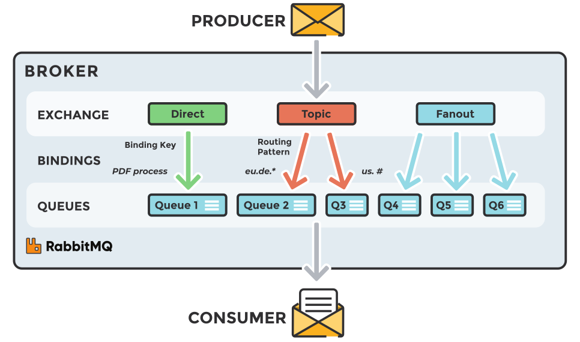

RabbitMQ cluster with Consul peer discovery
===========================================

This project aims to deploy RabbitMQ micro-service in a cluster with High Availability (HA)

The amount of RabbitMQ MS is defined in __docker-compose.yml__ file.

Consul will allow RabbitMQ nodes to know each other.


RabbitMQ concepts
=================

RabbitMQ is an application, also known as "message broker" or "queue manager", used to exchange data between services. It is widely used in micro-services architectures.

Exchanges
---------

The job of an exchange is to accept messages from a producer application and route them to the correct message queues depending on messages' attributes (e.g. routing key, properties).
Different types of exchange exist.

### Direct
Delivers message to queues which binding_key (routing_key defined in bindings) **exactly matches** message's routing_key.

```json
{
    "exchanges": [
        {
            "name": "MQcluster_exchange_direct",
            "vhost": "MQcluster_vhost",
            "type": "direct",
            "durable": true,
            "auto_delete": false,
            "internal": false,
            "arguments": {}
        }
    ],
    "queues": [
        {
            "name": "MQcluster_queue_direct",
            "vhost": "MQcluster_vhost",
            "durable": true,
            "auto_delete": false,
            "arguments": {}
        }
    ],
    "bindings": [
        {
            "source": "MQcluster_exchange_direct",
            "vhost": "MQcluster_vhost",
            "destination": "MQcluster_queue_direct",
            "destination_type": "queue",
            "routing_key": "MQcluster_routing_key_direct",
            "arguments": {}
        }
    ]
}
```

### Topic
Performs a **wildcard match** between message's routing_key and routing pattern specified in the binding.

```json
{
    "exchanges":[
        {
            "name": "MQcluster_exchange_topic",
            "vhost": "MQcluster_vhost",
            "type": "topic",
            "durable": true,
            "auto_delete": false,
            "internal": false,
            "arguments": {}
        },
    ],
    "queues":[
        {
            "name": "MQcluster_queue_topic_first",
            "vhost": "MQcluster_vhost",
            "durable": true,
            "auto_delete": false,
            "arguments": {}
        },
        {
            "name": "MQcluster_queue_topic_second",
            "vhost": "MQcluster_vhost",
            "durable": true,
            "auto_delete": false,
            "arguments": {}
        },
        {
            "name": "MQcluster_queue_topic_firstandsecond",
            "vhost": "MQcluster_vhost",
            "durable": true,
            "auto_delete": false,
            "arguments": {}
        },
    ],
    "bindings":[
         {
            "source": "MQcluster_exchange_topic",
            "vhost": "MQcluster_vhost",
            "destination": "MQcluster_queue_topic_first",
            "destination_type": "queue",
            "routing_key": "MQcluster_queue_topic.first",
            "arguments": {}
        },
        {
            "source": "MQcluster_exchange_topic",
            "vhost": "MQcluster_vhost",
            "destination": "MQcluster_queue_topic_second",
            "destination_type": "queue",
            "routing_key": "MQcluster_queue_topic.second",
            "arguments": {}
        },
        {
            "source": "MQcluster_exchange_topic",
            "vhost": "MQcluster_vhost",
            "destination": "MQcluster_queue_topic_firstandsecond",
            "destination_type": "queue",
            "routing_key": "MQcluster_queue_topic.#",
            "arguments": {}
        }
    ]
}
```

### Fanout
Routes messages to **all** of the queues that are bound to it.

```json
{
    "exchanges":[
        {
            "name": "MQcluster_exchange_fanout",
            "vhost": "MQcluster_vhost",
            "type": "fanout",
            "durable": true,
            "auto_delete": false,
            "internal": false,
            "arguments": {}
        },
    ],
    "queues":[
        {
            "name": "MQcluster_queue_fanout1",
            "vhost": "MQcluster_vhost",
            "durable": true,
            "auto_delete": false,
            "arguments": {}
        },
        {
            "name": "MQcluster_queue_fanout2",
            "vhost": "MQcluster_vhost",
            "durable": true,
            "auto_delete": false,
            "arguments": {}
        }
    ],
    "bindings":[
        {
            "source": "MQcluster_exchange_fanout",
            "vhost": "MQcluster_vhost",
            "destination": "MQcluster_queue_fanout1",
            "destination_type": "queue",
            "routing_key": "",
            "arguments": {}
        },
        {
            "source": "MQcluster_exchange_fanout",
            "vhost": "MQcluster_vhost",
            "destination": "MQcluster_queue_fanout2",
            "destination_type": "queue",
            "routing_key": "",
            "arguments": {}
        },
    ]
}
```

### Header
Uses the message's header attributes for routing purposes.

```json
{
    "exchanges":[
        {
            "name": "MQcluster_exchange_headers",
            "vhost": "MQcluster_vhost",
            "type": "direct",
            "durable": true,
            "auto_delete": false,
            "internal": false,
            "arguments": {}
        }
    ],
    "queues":[
        {
            "name": "MQcluster_queue_header",
            "vhost": "MQcluster_vhost",
            "durable": true,
            "auto_delete": false,
            "arguments": {}
        }
    ],
    "bindings":[
        {
            "source": "MQcluster_exchange_headers",
            "vhost": "MQcluster_vhost",
            "destination": "MQcluster_queue_header",
            "destination_type": "queue",
            "routing_key": "",
            "arguments": {
                "arg1": "val1",
                "arg2": "val2"
            }
        }
    ]
}
```




Configuration
-------------

### docker-compose
The __docker-compose.yml__ file defines two services : rabbitmq and consul.

#### rabbitmq
* RABBITMQ_ERLANG_COOKIE : only nodes with the same cookie will be able to communicate with each other.
* ports :
  - 15672 : UI (HTTP) (only if management_plugin is enabled)
  - 5671, 5672 : used by AMQP with and without TLS
* rabbitmq.conf : mainly for cluster configuration
* definitions.json : users, exchanges, queues, bindings, policies creation (-> see Best Pratices below)

#### consul
* ports :
  -  8500 : UI (HTTP)


Best practices for High Availability
------------------------------------

Configuration files in this project have been written to get HA.
Nevertheless, users should also configure their applications to fit the best practices for HA RabbitMQ cluster.

### Keep queues short
Longer queues impose more processing.

### Send persistent messages to durable queues and exchanges
To ensure that messages and brokers definitions survive restarts / crashes, ensure they are on disk.
To do so, exchanges and queues should be declared as **durable** and messages should be sent with delivery mode **persistent**

_Developers should set parameter **durable** to True in __definitions.json__ configuration file._
```json
{
    "exchanges": [
        {
            "name": "MQcluster_exchange_direct",
            "vhost": "MQcluster_vhost",
            "type": "direct",
            "durable": true,
            "auto_delete": false,
            "internal": false,
            "arguments": {}
        }
    ],
    "queues": [
        {
            "name": "MQcluster_queue_direct",
            "vhost": "MQcluster_vhost",
            "durable": true,
            "auto_delete": false,
            "arguments": {}
        }
    ]
}
```

_Developers should also send messages with parameter **delivery_mode=2**_:
```java
channel.basicPublish(exchangeName, routingKey,
             new AMQP.BasicProperties.Builder()
               .deliveryMode(2)
               .userId("guest")
               .build(),
               "Hello world!".getBytes());
```

### Enable lazy queues
Lazy queues write messages to disk immediatly.

_Developers should enable **lazy mode** when sending messages in __definitions.json__ configuration file._
```json
{	
    "policies": [
        {
            "vhost": "MQcluster_vhost",
            "name": "MQcluster_policy",
            "pattern": "",
            "apply-to": "all",
            "definition": {
                "ha-mode": "all",
                "ha-sync-mode": "automatic",
                "queue-mode": "lazy"
            }
        }
    ]
}
```

_N.B_ : *"ha-mode":"all"* and *"ha-sync-mode":"automatic"* must be set to allow queue mirroring (~synchronizing ) 

### RabbitMQ HA - 2 nodes
Two nodes are optimal for HA.

_Developers should set this amount of node in __docker-compose.yml__ file._

### Do not enable HiPE (High Performance Erlang)
HiPE increase server throughout but increase startup time. Enabling HiPE means compiling RabbitMQ at startup. 

### Management statistics rate mode
Setting the rate mode of RabbitMQ management statistics to 'detailed' has a serious impast on performance.

### Limited use of priority queues
Each priority level uses an internal queue on the ERlang VM.


Demonstration
=============

Scenario 1
----------

1. Send messages to cluster. Messages are duplicated in all services
2. Delete n-1 RabbitMQ services
3. Wait for services to restart

=> RabbitMQ services should synchronize each other ; thus messages should be found in all services


Scenario 2
----------

1. Step 1 from scenario 1
2. Delete **all** RabbitMQ services
3. Wait for services to restart

=> All messages are lost. May use a volume to store messages on host disk ?